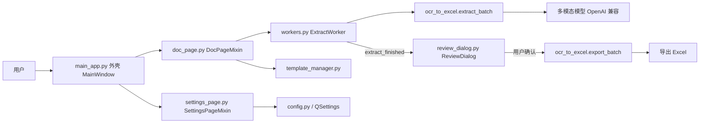

# AI-Excel-Tool 项目结构说明

## 1. 项目定位

本项目是一个基于 PySide6 的 Windows 桌面工具，用于将单据图片或已有 Excel/CSV 文件转换为符合指定模板的入库 Excel 表格，方便后续录入会计软件。

核心能力包括：

- 批量导入图片或 Excel/CSV 文件。
- 图片与表格统一交给一个 **OpenAI 兼容的多模态（视觉）模型**，一步提取结构化商品记录与单据元信息。
- 接口可自定义：内置「智谱 GLM / OpenAI / 通义千问 / 自定义」预设，也可手填 base_url + 模型 + API Key。
- 按内置或自定义 Excel 模板表头导出标准 Excel。
- 支持手写体识别增强、合并输出、智能文件命名。
- **导出前人工复核**：识别完成后先在可编辑表格中核对、修改，确认无误再落盘——数据要进会计软件，准确性第一。

> 历史说明：早期版本采用「智谱 GLM-OCR layout_parsing + DeepSeek 两段式」管线，并附带一个独立的 AI 对话助手。重构后已合并为单视觉模型一步出 JSON，并删除对话助手，依赖与配置大幅精简。

## 2. 技术栈

| 类型 | 技术或依赖 | 用途 |
| --- | --- | --- |
| 桌面界面 | PySide6 | 窗口、文件拖拽、进度条、表格、复核弹窗等底层控件 |
| Fluent 界面 | PySide6-Fluent-Widgets (qfluentwidgets) | Win11 风格外壳：标题栏、侧边导航、亮暗双主题、Fluent 控件与 InfoBar 浮层 |
| 大模型客户端 | openai | 以 OpenAI SDK 兼容方式调用任意多模态模型 |
| 数据处理 | pandas | 读取 Excel/CSV 内容、构造导出表格 |
| Excel 读取 | xlrd, openpyxl | 分别读取 .xls 和 .xlsx |
| Excel 导出 | openpyxl | 写出 .xlsx |
| Windows 打包 | PyInstaller, app.manifest | build_log.txt 显示曾使用 PyInstaller 打包为 exe |

`requirements.txt` 共 6 项：`PySide6`、`PySide6-Fluent-Widgets`、`pandas`、`xlrd`、`openpyxl`、`openai`。`PySide6-Fluent-Widgets` 会带入 `qframelesswindow`、`darkdetect` 等传递依赖。重构时已移除 `requests`、`zhipuai`、`Pillow`。

## 3. 文件结构

```text
AI-Excel-Tool/
├─ main_app.py                 # 程序入口与主窗口外壳（组合各 Mixin）
├─ config.py                   # 集中配置：接口预设、模型、运行常量、ApiConfig
├─ widgets.py                  # 自定义控件 FileDropListWidget（基于 qfluentwidgets.ListWidget，拖拽落入文件）
├─ doc_page.py                 # 「单据处理」页（DocPageMixin）
├─ settings_page.py            # 「设置」页（SettingsPageMixin）
├─ workers.py                  # 后台线程 ExtractWorker（只识别）
├─ review_dialog.py            # 导出前人工复核弹窗 ReviewDialog
├─ ocr_to_excel.py             # 核心业务：识别（extract）+ 导出（export）
├─ template_manager.py         # 内置模板与用户自定义模板管理
├─ prompts/
│  └─ extract.txt              # 提取任务的系统提示词（含手写体占位符）
├─ templates/
│  ├─ 进货单商品导入模板.xls    # 内置模板 1
│  └─ 多规格商品模板.xls        # 内置模板 2
├─ requirements.txt            # Python 运行依赖（6 项）
├─ README.md                   # 项目简介和快速上手
├─ LICENSE                     # MIT License
├─ app.manifest                # Windows exe manifest，高 DPI 和权限声明
└─ build_log.txt               # PyInstaller 打包日志
```

运行过程中还可能出现：

- `user_templates.json`：用户添加自定义模板后生成，由 `TemplateManager` 维护。
- `__pycache__/`：Python 编译缓存，已被 `.gitignore` 忽略。
- 输出 Excel 文件：默认生成在首个输入文件所在目录，文件名通常为 `日期_供应商_入库.xlsx`。

## 4. 总体架构

项目采用单体桌面应用结构，UI 层、后台线程、核心业务层分离清晰。主窗口用 **Mixin 组合**方式按页面拆分到多个文件：



主要分层如下：

- 表现层：`main_app.py`（FluentWindow 外壳）+ `doc_page.py` / `settings_page.py`（页面 Mixin）+ `widgets.py`；界面控件、亮暗主题与 InfoBar 浮层均由 `qfluentwidgets` 提供。
- 线程层：`workers.py` 的 `ExtractWorker`，只负责把耗时的「识别」放到后台。
- 复核层：`review_dialog.py` 的 `ReviewDialog`，识别与导出之间的人工核对环节。
- 业务流程层：`ocr_to_excel.py`，识别（extract）与导出（export）两段可独立调用。
- 配置/资源层：`config.py`、`template_manager.py`、内置 `templates/`、`prompts/`、`QSettings`、可选 `user_templates.json`。

### 4.1 Mixin 组合方式

`MainWindow` 同时继承多个 Mixin 与 `QMainWindow`：

```python
class MainWindow(DocPageMixin, SettingsPageMixin, FluentWindow):
    def __init__(self):
        super().__init__()
        ...
```

- Mixin 自身不写 `__init__`，`super().__init__()` 沿 MRO 抵达 `FluentWindow`。
- 各页面的构建/事件方法分散在对应 Mixin 文件里，但 `self` 始终是同一个主窗口实例，共享 `self.settings`、`self._append_log` 等状态与方法。
- `main_app.py` 只保留外壳：FluentWindow 标题栏与侧边导航、运行日志页、InfoBar 浮层、主题引擎、Qt 加速等。

## 5. 主入口与页面结构

### 5.1 程序入口

入口位于 `main_app.py`：

- `main()`：配置高 DPI 取整策略与 Qt OpenGL 渲染、创建 `QApplication`、设主题色 `setThemeColor("#4f8ef7")`、按 QSettings `ui/theme` 调 `setTheme(AUTO/LIGHT/DARK)`、展示 `MainWindow`（不再 `setStyle("Fusion")`）。
- `_configure_qt_acceleration()`：设置桌面 OpenGL、共享 OpenGL 上下文、抗锯齿等 Qt 图形参数。
- `if __name__ == "__main__": main()`：直接运行桌面程序。

### 5.2 MainWindow

`MainWindow` 是应用主窗口外壳。主要职责：

- 初始化 `QSettings("InvoiceAI", "InvoiceAIDesktop")` 用于保存接口配置。
- 初始化 `TemplateManager(BASE_DIR)` 管理模板。
- 维护已选文件、输出文件、后台任务状态、日志缓存、图片预览缓存。
- 继承 `FluentWindow`，用 `addSubInterface` 注册子界面（标题栏、侧边导航、内容堆栈、亮暗主题均由基类提供，不再手写侧边栏/路由）。
- 启动时一次性构建三页，每页须先设唯一 `objectName`（`docInterface` / `logInterface` / `settingsInterface`），否则 `addSubInterface` 会报错。

三个子界面通过 `addSubInterface(interface, FluentIcon, 文本, 位置)` 注册：

| 页面 | 构建函数 | 来源 | 导航位置 | 功能 |
| --- | --- | --- | --- | --- |
| 单据处理 | `_build_doc_page()` | DocPageMixin | 顶部 | 文件导入、图片预览、模板选择、手写体识别、合并输出、开始识别 |
| 运行日志 | `_build_log_page()` | main_app.py | 底部 | 只读 `TextEdit`，展示带时间戳的运行日志（原底部日志抽屉迁移至此独立页） |
| 设置 | `_build_setting_page()` | SettingsPageMixin | 底部 | 接口预设 / base_url / 模型 / API Key，外加界面主题（跟随系统 / 浅色 / 深色）切换 |

> 重构后已删除原「AI 助手」页面及其后台线程、对话气泡。

## 6. 单据处理功能链路

### 6.1 UI 侧流程

用户在「单据处理」页面完成以下操作：

1. 点击「浏览文件」或拖拽文件到列表（拖拽由 `FileDropListWidget` 处理）。
2. 文件扩展名会被限制在图片和表格格式内。
3. 图片文件可在右侧预览；Excel/CSV 文件不做图片预览。
4. 选择模板。
5. 可选开启「手写体识别」。
6. 可选开启「合并输出到一个 Excel」。
7. 点击「开始识别」。

相关常量集中在 `config.py`：

- `IMG_EXTS = {".jpg", ".jpeg", ".png", ".bmp", ".webp", ".tiff"}`
- `EXCEL_EXTS = {".xlsx", ".xls", ".csv"}`
- `ALL_EXTS = IMG_EXTS | EXCEL_EXTS`

### 6.2 后台线程（只识别）

`ExtractWorker(QThread)`（`workers.py`）把耗时的「识别」放到后台线程，避免阻塞 UI。导出不在此完成——导出很快，留给主线程在用户复核确认后执行。

信号设计：

| 信号 | 说明 |
| --- | --- |
| `progress_update(int, int)` | 当前进度和总数 |
| `log_message(str)` | 处理日志 |
| `extract_finished(object)` | 传出 `extract_batch` 的结果 dict |
| `task_failed(str)` | 返回错误信息 |

`ExtractWorker.run()` 调用 `extract_batch()`，传入：输入文件路径列表、是否手写体增强、模板路径、`ApiConfig`。

### 6.3 识别 → 复核 → 导出的接线

`DocPageMixin` 内的衔接逻辑：

1. `_on_start_process()`：校验文件/接口/模板，把导出参数（`_pending_output_dir`、`_pending_merge`）先存起来，创建并启动 `ExtractWorker`。
2. `_on_extract_finished(extraction)`：识别完成。若无任何记录则提示并停止；否则弹出 `ReviewDialog`。
3. 用户在复核窗确认（Accepted）→ `get_edited_extraction()` 取回编辑后的数据 → `_do_export()` 调用 `export_batch()` 落盘；用户取消则不导出。
4. `_do_export()`：在主线程导出，更新进度、日志、输出文件列表，并弹出完成提示。

## 7. 核心业务流程

核心逻辑集中在 `ocr_to_excel.py`，分为**识别**与**导出**两段，二者可独立调用，复核环节正好插在中间。

### 7.1 识别：单文件提取

`extract_records(file_path, headers, handwriting=False, api_config=None, log=print)` 是统一入口：

```text
输入图片或 Excel/CSV
-> 图片：转 data:image/...;base64 作为 image_url
   表格：read_excel_as_text() 读成文本
-> 拼接「模板表头字段 + 提取要求」作为 user 消息
-> 调用所配置的多模态模型（system 提示词来自 prompts/extract.txt）
-> _parse_extract_result() 解析为 (records, meta)
```

- 模型客户端由 `_build_client(api_config)` 用 `openai.OpenAI(api_key, base_url)` 构造。
- 调用参数：`temperature=EXTRACT_TEMPERATURE(0.0)`、`max_tokens=EXTRACT_MAX_TOKENS(4096)`。
- `meta` 形如 `{"supplier": "...", "date": "YYYY-MM-DD"}`，驱动后续智能命名。

### 7.2 识别：批量提取（不落盘）

`extract_batch(image_paths, ...) -> dict` 只识别、不写文件，供「导出前人工复核」使用：

1. 读取一次模板表头。
2. 遍历每个文件调用 `extract_records`。
3. 成功的进 `items`，失败的（含「未提取到任何商品记录」）记入 `failed` 并跳过。
4. 通过 `progress_callback` 回报进度。

返回结构：

```python
{
  "headers": [...],                          # 模板表头字段
  "items": [                                 # 每个成功文件一条
    {"name": "文件名", "path": "路径",
     "records": [ {表头字段: 值, ...}, ... ],
     "meta": {"supplier": "...", "date": "..."}},
    ...
  ],
  "failed": [ ("文件名", "错误信息"), ... ],
}
```

### 7.3 导出：写出 Excel

`export_batch(extraction, output_dir, merge_output=False, ...) -> list` 把（可能经人工复核修改过的）数据写成 Excel：

- 仅使用 `extraction` 中的 `headers` 与 `items`；`items` 为空时抛 `RuntimeError("没有可导出的记录")`。
- 输出文件名按各 `item` 的 `meta` **在导出时即时生成**，因此用户在复核窗改了供应商/日期会反映到文件名。
- `merge_output=True` 合并为一个 Excel；否则每个文件分别导出。

底层导出函数：

- `export_to_excel(records, headers, output_path)`：单文件导出。
- `export_merged_excel(all_records, headers, output_path)`：合并导出。
- `export_separate_excel(all_records, headers, output_paths)`：批量分别导出。

导出原则：以模板表头顺序为准，逐字段取值，缺失字段用空字符串，最终 `pandas.DataFrame.to_excel(..., engine="openpyxl")` 写出。

### 7.4 一步到位入口（命令行/无人值守）

`process_images_batch(...)` 现在是 `extract_batch` + `export_batch` 的薄组合，保留给命令行或无人值守场景（识别即导出、无人工复核）。GUI 不再走它。
`process_image(...)` 处理单个文件，同样供命令行测试。

### 7.5 模板表头读取

`get_template_headers(tpl_path)` 用 pandas 打开模板（`.xls` 走 `xlrd`，`.xlsx` 走 `openpyxl`），读取 `config.TEMPLATE_HEADER_ROW`（默认 `1`，即第 2 行）：

- 第 0 行视为说明行，第 1 行视为真正字段表头。
- 空表头/`nan` 会被过滤；无有效表头时抛 `ValueError`。

### 7.6 输入读取

- `image_to_data_url(image_path)`：图片转 `data:image/<mime>;base64,...`。
- `read_excel_as_text(excel_path)`：表格转文本，供模型对齐字段。
  - `.csv`：`pandas.read_csv`，UTF-8 失败时回退 `gbk`。
  - `.xls`：`xlrd` 引擎；其余按 `.xlsx` 走 `openpyxl`。
  - 读取所有工作表，每行用制表符拼接。

### 7.7 提示词与结果解析

- 系统提示词存放在 `prompts/extract.txt`，`_load_extract_system_prompt(handwriting)` 读取它；勾选手写体时把 `__HANDWRITING_NOTE__` 占位符替换为「以手写实际修改为准」的补充要求。
- 期望模型输出（纯 JSON，不带 markdown）：

```json
{
  "meta": { "supplier": "供应商或卖方名称", "date": "YYYY-MM-DD" },
  "records": [ { "模板字段1": "字段值", "模板字段2": "字段值" } ]
}
```

- `_parse_extract_result()` 容错：优先整体 JSON → 退而提取最外层 `{...}` → 再退到数组 `[...]`；完全无法解析时抛 `ExtractionError`。

### 7.8 智能命名

`_build_smart_filename(meta, output_dir, suffix="_入库.xlsx")` 规则：

- 默认格式：`YYYY-MM-DD_供应商名称_入库.xlsx`。
- 日期缺失用当天日期；供应商缺失用 `未知供应商`。
- 移除文件名非法字符；同名存在时追加 `_2`、`_3` …。
- 合并输出时后缀为 `_合并入库.xlsx`。

## 8. 导出前人工复核

`review_dialog.py` 的 `ReviewDialog(QDialog)` 是识别与导出之间的人工核对环节。

用法：

```python
dlg = ReviewDialog(extraction, parent)
if dlg.exec() == QDialog.DialogCode.Accepted:
    edited = dlg.get_edited_extraction()
    export_batch(edited, ...)
```

界面与能力：

- 顶部标题 + 失败文件提示（若有，列出不会导出的文件名）。
- 多文件时用下拉框（`ComboBox` + `QStackedWidget`）在文件之间切换；单文件时隐藏切换条。
- 每个文件一页：可编辑的「供应商 / 日期」输入框（`LineEdit`）+ 一张 `TableWidget`（列=模板表头，行=识别记录）。
- 表格支持改单元格、「增加行」「删除选中行」。
- `get_edited_extraction()` 把表格与供应商/日期回读为与 `extract_batch` 同构的 `extraction`；`_read_table()` 会丢弃整行全空的记录。
- 「确认导出」前若总记录数为 0 会用 `InfoBar` 拦截提示；「取消」则不导出。
- `ReviewDialog` 本身是 `QDialog`，不随 Fluent 主题自动着色，构造时按 `isDarkTheme()` 给底板上深/浅底色。

## 9. 模板管理

模板管理由 `template_manager.py` 中的 `TemplateManager` 负责。

### 9.1 内置模板

内置模板注册在 `BUILTIN_TEMPLATES`（显示名称 → 相对 `templates/` 的相对路径）：

| 显示名称 | 文件 |
| --- | --- |
| 进货单商品导入模板 | `templates/进货单商品导入模板.xls` |
| 多规格商品模板 | `templates/多规格商品模板.xls` |

内置模板路径按 `base_dir + 相对路径` 拼接，且只有文件实际存在时才出现在 UI 下拉框。

### 9.2 自定义模板

- `_on_add_custom_template()` 打开文件选择框，文件名去扩展名作为显示名称。
- `TemplateManager.add_custom_template()` 保存显示名称和绝对路径，持久化到 `user_templates.json`。
- `remove_custom_template()` 已实现，但当前 UI 没有删除入口。

## 10. 接口配置（base_url / 模型 / API Key）

重构后不再把接口写死，三要素由用户在「设置」页填写。

### 10.1 集中默认值（config.py）

- `PROVIDER_PRESETS`：`智谱 GLM` / `OpenAI` / `通义千问` / `自定义`，每项含 `base_url` 与默认 `model`。
- `DEFAULT_PROVIDER = "智谱 GLM"`；`GLM_BASE_URL`、`EXTRACT_MODEL` 由默认预设派生。
- `ApiConfig(base_url, model, api_key="")`：冻结 dataclass，把三要素打包一起传递，贯穿 `ExtractWorker → extract_batch → extract_records`。
- 备选 GLM 模型：`glm-4.6v`（推荐）/ `glm-4.6v-flash`（免费偏弱）/ `glm-4v-flash`（老版兜底）。

### 10.2 设置页与持久化（settings_page.py）

- 预设下拉切换时自动回填 base_url + 模型，仍可手动修改。
- 「保存配置」写入 `QSettings`：`api/provider`、`api/base_url`、`api/model`、`api/api_key`。
- 「测试连通性」按当前输入框的值发一次**最小多模态请求**（一句文本 + 一张内联的 32×32 测试图）探活：后台用 `ConnectivityWorker`（`workers.py`）调 `ocr_to_excel.test_connectivity()`，复用与识别相同的 `_build_client` 鉴权路径与 `image_url` 形式（含 API Key 环境变量兜底，带 20s 超时），因此连「模型是否支持视觉输入」一起验掉，而不只是文本连通。结果用 `InfoBar` 提示，测试期间禁用按钮、防重入。
- `_require_api_config()` 在开始识别前校验 base_url / 模型 / API Key 三者齐全，缺失则提示并跳转设置。

### 10.3 环境变量兜底

设置页显式填写的 Key 优先级最高；为空时回退环境变量 `ZHIPU_API_KEY` 或 `GLM_API_KEY`（见 `config.GLM_ENV_NAMES`）。

## 11. Windows 桌面与打包相关

`app.manifest` 包含：

- 应用名称和描述。
- `requestedExecutionLevel level="asInvoker"`，不主动要求管理员权限。
- 高 DPI 感知声明，减少 Windows 缩放造成的模糊。
- Windows 7 到 Windows 10/11 的兼容声明。

打包以仓库内的 `InvoiceAI.spec` 为准（入口 `main_app.py`，onefile + windowed，`console=False`，套 `app.manifest`）：除把 `templates/`、`prompts/` 纳入数据文件、`openai` 列入 hidden imports 外，spec 顶部用 `collect_all` 全量收集 `qfluentwidgets`、`qframelesswindow`、`darkdetect` 的资源与子模块——Fluent 的 QSS/字体/图标极易漏打，必须如此，否则 exe 启动即缺资源。`build_log.txt` 只是一次历史打包日志，不是可重复构建脚本。

## 12. 主要数据流

```text
用户选择文件
-> doc_page.py 校验扩展名并加入列表
-> 用户点击开始识别（先存好导出参数 _pending_output_dir / _pending_merge）
-> ExtractWorker 后台调用 extract_batch
-> get_template_headers 读取模板字段
-> 逐文件 extract_records：图片走视觉、表格走文本，统一调用多模态模型一步出 JSON
-> 返回 {headers, items, failed}，发出 extract_finished
-> 弹出 ReviewDialog 人工复核（可改单元格 / 供应商 / 日期 / 增删行）
-> 用户确认 -> get_edited_extraction 回读 -> export_batch（主线程）
-> _build_smart_filename 按复核后的 meta 生成文件名
-> openpyxl 写出 .xlsx
-> UI 更新进度、日志和输出文件列表
```

## 13. 可扩展点

### 13.1 新增内置模板

修改 `template_manager.py`，并把模板文件放进 `templates/`：

```python
BUILTIN_TEMPLATES = {
    "进货单商品导入模板": os.path.join("templates", "进货单商品导入模板.xls"),
    "多规格商品模板":     os.path.join("templates", "多规格商品模板.xls"),
    "新模板显示名":       os.path.join("templates", "新模板文件.xls"),
}
```

### 13.2 支持更多输入格式

需要同时修改：

- `config.py` 中的 `IMG_EXTS` 或 `EXCEL_EXTS`。
- `ocr_to_excel.py` 中 `read_excel_as_text()` 的读取分支（如新增的表格类型）。

### 13.3 更换模型 / 接口供应商

通常无需改代码：在「设置」页选预设或填「自定义」即可。若要改默认或新增预设，编辑 `config.py` 的 `PROVIDER_PRESETS` / `DEFAULT_PROVIDER`。调整提示词改 `prompts/extract.txt`。

### 13.4 自定义输出格式

- 文件命名：`_build_smart_filename()`。
- 单文件 / 合并导出：`export_to_excel()` / `export_merged_excel()`。
- 导出整体编排：`export_batch()`。

## 14. 当前维护注意事项

- 改模型/地址先看 `config.py`；若 `glm-4.6v` 报模型不存在，可回退 `glm-4v-flash`（已知可用）。
- 模板表头固定读取第 2 行（`TEMPLATE_HEADER_ROW`）。模板格式变化时同步调整。
- 接口配置（含 API Key）保存在本机 `QSettings`，适合个人桌面软件；多人/企业部署需重新设计密钥管理。**提交代码前注意不要把真实 Key 写进源码或文档。**
- 模型输出解析虽有容错，但仍依赖模型严格输出 JSON；业务稳定性要求更高时可加 JSON Schema 校验与字段级清洗。
- `TemplateManager.remove_custom_template()` 已有后端方法，但 UI 还没有删除模板按钮。
- 识别在后台线程、导出在主线程，复核为模态弹窗——新增长耗时步骤时注意不要放回主线程阻塞 UI。
- 打包以 `InvoiceAI.spec` 为准（已用 `collect_all` 纳入 qfluentwidgets 等 Fluent 资源 + `templates/`、`prompts/`）；`build_log.txt` 只是历史日志，不是构建脚本。新增 Fluent 相关依赖时记得同步 spec 的 `collect_all` 列表。

## 15. 快速运行理解

本项目指定运行在 Python 3.10。开发环境通常按以下方式运行：

```bash
pip install -r requirements.txt
python main_app.py
```

`ocr_to_excel.py` 也保留命令行处理函数（`process_image` / `process_images_batch`），但日常使用以 `main_app.py` 桌面入口为主。
